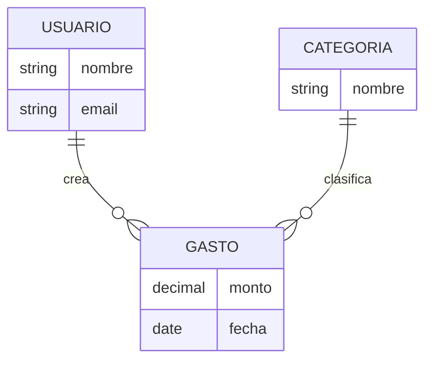

# Modelo de datos — referencia para el bloque 4

Se carga solo cuando la conversación llega al bloque 4. Contiene el detalle de formas normales y la guía del diagrama `erDiagram` — en `SKILL.md` solo va la versión corta.

## Formas normales — qué resuelve cada una, por qué 3FN es el default

**1FN (Primera Forma Normal).** Cada campo guarda un solo valor, no listas metidas en un campo de texto (ej. no una columna "teléfonos" con "555-1234, 555-5678" separado por comas). Prácticamente todo diseño moderno ya cumple esto sin pensarlo.

**2FN.** Sin dependencias parciales — en una tabla con clave compuesta, cada campo depende de la clave completa, no de una parte de ella. Solo es relevante cuando ya hay claves compuestas, algo que hoy es poco común en diseños nuevos (se prefieren claves simples autogeneradas).

**3FN — el estándar por defecto.** Sin dependencias transitivas: un campo no depende de otro campo que no sea la clave (ej. si una tabla `Pedido` tiene `id_cliente` y además `nombre_cliente` copiado ahí, `nombre_cliente` depende de `id_cliente`, no de la clave del pedido — duplicación que se rompe fácil si el cliente cambia de nombre). 3FN evita la inmensa mayoría de los problemas de duplicación e inconsistencia sin volverse difícil de trabajar. Es la que se propone por default para prácticamente cualquier proyecto nuevo.

**4FN — nicho, rara vez hace falta.** Resuelve dependencias multivaluadas independientes: cuando una entidad tiene dos conjuntos de datos que no tienen relación entre sí, pero viven juntos en la misma tabla, generando combinaciones que no deberían existir. Ejemplo clásico: una tabla `Empleado_Habilidad_Proyecto` donde un empleado tiene varias habilidades Y varios proyectos, sin que habilidades y proyectos se relacionen entre sí — mezclarlos en una sola tabla obliga a repetir cada habilidad por cada proyecto (y viceversa), generando filas que no representan nada real. La solución es partir en dos tablas independientes (`Empleado_Habilidad`, `Empleado_Proyecto`).

**Cuándo preguntar por 4FN en la práctica:** cuando el usuario describe una entidad con dos listas de cosas claramente no relacionadas entre sí colgando de la misma entidad (ej. "un profesor tiene varios cursos que dicta y varios idiomas que habla" — cursos e idiomas no se relacionan entre sí). Si no aparece un caso así explícito, no ofrecerlo — proponer 4FN sin ese caso concreto agrega complejidad que el proyecto no necesita.

**Nota de honestidad de alcance:** decidir el nivel de normalización de verdad requiere conocer los atributos y las dependencias funcionales exactas de cada tabla — eso se resuelve recién en el diseño físico (bloque 7 en adelante, al implementar). Lo que se fija en el bloque 4 es la *intención* (3FN salvo que ya se vea un caso de 4FN), documentada como criterio a aplicar cuando llegue ese diseño — no una normalización ya hecha sobre entidades que todavía no tienen todos sus atributos definidos.

## Diagrama `erDiagram` — cómo armarlo

Sintaxis Mermaid, ejemplo con el caso de control de gastos usado en `SKILL.md`:

**Notación de cardinalidad** (el símbolo va pegado a cada extremo de la relación):
- `||--||` uno a uno
- `||--o{` uno a muchos (el lado `o{` es el "muchos", puede ser cero o más)
- `}o--o{` muchos a muchos

**Qué incluir en esta etapa (conceptual, no físico):**
- Todas las entidades ya confirmadas en las preguntas 1-2.
- Las relaciones entre ellas, con su cardinalidad — se infiere de cómo el usuario las describió en prosa (ej. "un Gasto pertenece a una Categoría" → `CATEGORIA ||--o{ GASTO`).
- Atributos **solo** si el usuario ya los mencionó espontáneamente (ver nota del bloque 4 en `SKILL.md`) — no completar con campos inventados para que el diagrama "se vea completo". Un bloque de atributos vacío para una entidad es preferible a atributos inventados que después no coincidan con la implementación real.

**Qué no incluir todavía:** tipos de dato exactos, claves primarias/foráneas explícitas, ni tablas intermedias de relaciones muchos-a-muchos (eso es diseño físico, se resuelve al implementar).
